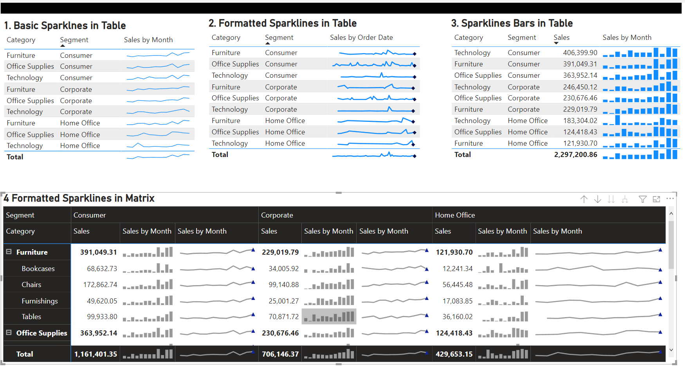

## Key Features
* abc
* def

## How to Use
To clone and visualize this, you'll need [Git](https://git-scm.com) and [Microsoft PowerBI Tool](https://powerbi.microsoft.com) installed in your computer.

* blah
* blah

> ** Note ** Discalimer: 

## Credits
- blah
- blah

## Screenshots

## License
[GNU GENERAL PUBLIC LICENSE version 3](http://www.gnu.org/licenses/gpl-3.0.html)

---

> Email: [msunith@gmail.com](mailto://msunith@gmail.com) &nbsp;&middot;&nbsp;
> GitHub: [github.com/msunith](https://github.com/msunith)